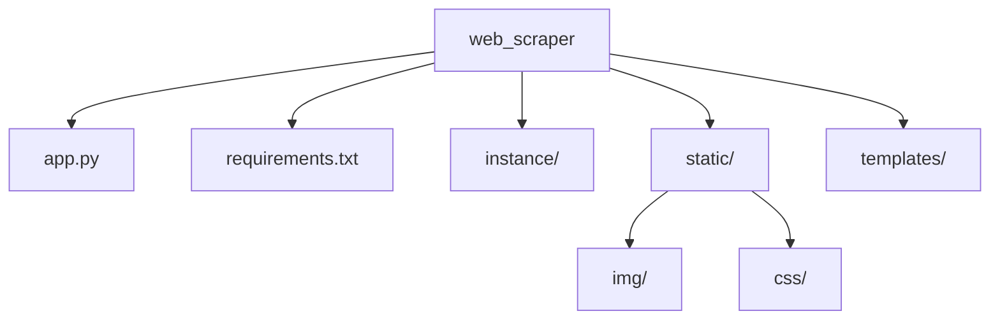

# 🕷️ Web Scraper Project

  

<h3>A powerful web scraping application built with Flask that allows you to scrape websites, schedule scraping jobs, and export data in multiple formats. 🚀</h3>

[Demo](#demo) • [Features](#features) • [Installation](#installation) • [Usage](#usage) • [Contributing](#contributing)

## 🎥 Demo

  

## ✨ Features

| Feature | Description |
|---------|-------------|
| 🔐 Authentication | Secure user registration and login system |
| 🌐 Web Scraping | Easy scraping with CSS selectors |
| ⏰ Scheduling | Automated scheduled scraping jobs |
| 📊 Export Options | Multiple format support (CSV, JSON, XLSX) |
| 📝 Logging | Detailed activity tracking |
| 🔄 Live Preview | Real-time scraping results |

// ... existing code for Quick Start section ...

## 📁 Project Structure

// ... existing code for remaining sections ...

### Made with ❤️ by Shivam

[⬆ Back to Top](#-web-scraper-project)

