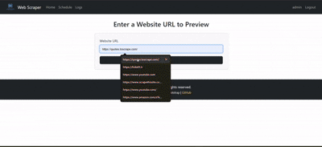

# 🕷️ Web Scraper Project

A powerful web scraping application built with Flask that allows you to scrape websites, schedule scraping jobs, and export data in multiple formats.


## 🎥 Demo Video
<video width="800" controls>
  <source src="static/img/demo.mp4" type="video/mp4">
  Your browser does not support the video tag.
</video>



<br>

<p align="center"></p>


## ✨ Features

- 🔐 User Authentication (Register/Login)
- 🌐 Web Scraping with CSS Selectors
- ⏰ Scheduled Scraping Jobs
- 📊 Multiple Export Formats (CSV, JSON, XLSX)
- 📝 Activity Logging
- 🔄 Real-time Scraping Preview

## 🚀 Quick Start

### Prerequisites

- Python 3.8 or higher
- pip (Python package installer)
- Git (optional)

### Step 1: Clone the Repository

```bash
git clone https://github.com/Shivam99984/web-scrapple-py.git
cd web-scraper
```

### Step 2: Create a Virtual Environment(Optional)

```bash
# Windows
python -m venv venv
venv\Scripts\activate

# Linux/MacOS
python3 -m venv venv
source venv/bin/activate
```

### Step 3: Install Dependencies

```bash
pip install -r requirements.txt
```

### Step 4: Set Up Environment Variables(Optional)

Create a `.env` file in the project root:

```env
FLASK_APP=app.py
FLASK_ENV=development
SECRET_KEY=your-secret-key-here
DATABASE_URI=sqlite:///instance/web_scraper.db
```

### Step 5: Initialize the Database

```bash
flask db init
flask db migrate
flask db upgrade
```

### Step 6: Create Example User (Optional)

```bash
python create_example_user.py
```

### Step 7: Run the Application

```bash
<<<<<<< HEAD
python app.py
=======
   python app.py
>>>>>>> 1ac8f8b2ca583cf9be29d30eb076b5d5cffe90d0
```

Visit `http://localhost:5000` e.g http://127.0.0.1:5000/ in your browser to access the application.

## 📁 Project Structure

The project structure is organized as follows:

```
web_scraper/
├── app.py              # Main application file that initializes the Flask app and contains routing logic
├── requirements.txt    # Lists all the Python packages required for the project
├── usage.log           # Application logs that track user activities and scraping operations
├── instance/           # Contains instance-specific files, such as the database
├── static/             # Static files (CSS, JS, images) used by the application
│   ├── img/            # Directory for images used in the application
│   └── css/            # Directory for CSS files
├── templates/          # HTML templates for rendering views in the application
└── __pycache__/        # Python cache files generated by the interpreter
```

## 🔧 Main Components

### app.py
The main application file containing:
- Flask web application setup
- Database models (User, ScheduledJob, ScrapingResult)
- Web scraping functionality
- Authentication routes
- API endpoints for scraping and scheduling
- Export functionality (CSV, JSON, XLSX)

### Database Models
1. **User**
   - Username
   - Email
   - Password (hashed)
   - Creation timestamp

2. **ScheduledJob**
   - Job ID
   - URL
   - CSS Selector
   - Interval
   - Next run time
   - User association

3. **ScrapingResult**
   - Job association
   - Scraped data
   - Timestamp

## 📚 Usage Guide

### 1. User Authentication
- Register a new account
- Login with your credentials
- Manage your profile

### 2. Web Scraping
1. Enter the target URL
2. Specify CSS selectors
3. Preview the results
4. Save or schedule the scraping job

### 3. Scheduled Jobs
- Create recurring scraping tasks
- Set intervals (daily, weekly, monthly)
- View and manage scheduled jobs
- Monitor scraping results

### 4. Data Export
- Export to CSV
- Export to JSON
- Export to Excel (XLSX)
- Download files directly

## 🔍 Logging
- Application logs are stored in `usage.log`
- Tracks user activities and scraping operations
- Error logging for debugging

## 🤝 Contributing

1. Fork the repository
2. Create your feature branch (`git checkout -b feature/AmazingFeature`)
3. Commit your changes (`git commit -m 'Add some AmazingFeature'`)
4. Push to the branch (`git push origin feature/AmazingFeature`)
5. Open a Pull Request

## 📝 License

This project is licensed under the MIT License - see the [LICENSE](LICENSE) file for details.

## 📞 Support

For support, message me  or open an issue in the repository.

---

Made with ❤️ by Shivam
